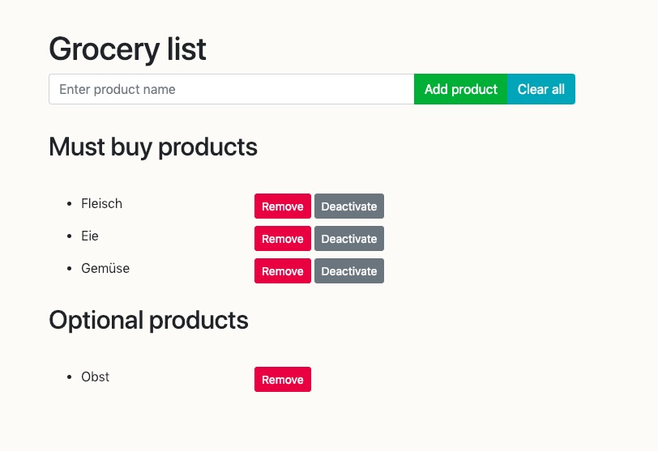
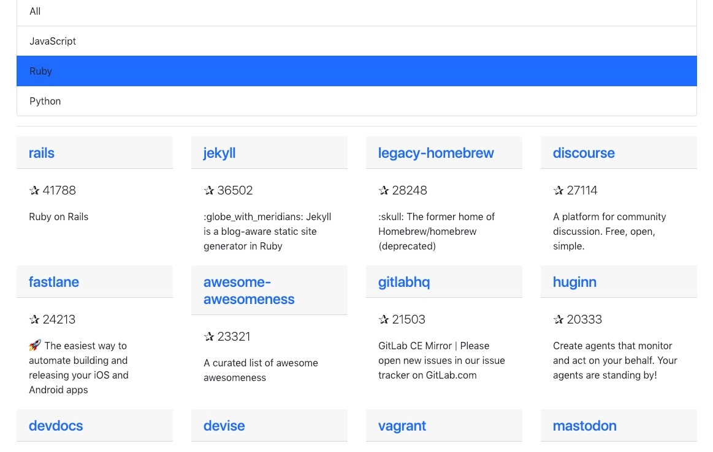
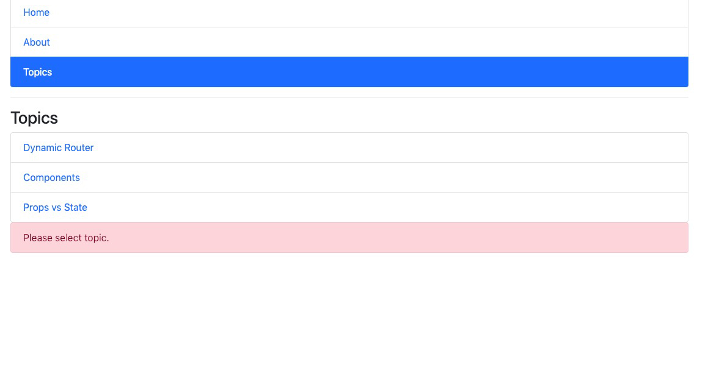

Follow along a [4-day React.js bootcamp](https://tylermcginnis.com/free-react-bootcamp/) by Tyler McGinnis.

## Day 1
JSX, createElement, functional components, class components, explicit mutations.

## Day 2
Component state, updating state, click handlers.

## Day 3
Lifecycle Events, componentDidMount, componentDidUpdate, componentWillUnmount, shouldComponentUpdate,
Ajax requests, dynamic rendering.

## Day 4
Create react app, react router v4, route matching, URL parameters, nested routes.

